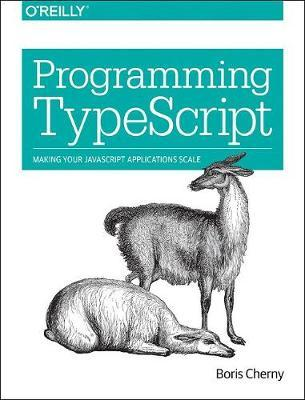

# **TypeScript O'Reilly 책을 통한 TypeScript 실습 및 공부**

<ins>`본 Repository의 실습 내용은 O'Reilly TypeScript책에 있는 예제, 연습문제를 기반으로 하였습니다.`</ins>

 

# **실습내용**

실습의 전반적인 내용은 아래 링크의 페이지에 자세하게 설명이 되어있다.  

🗓️ 2021.02.15 (Mon)

- **독서** : 1 ~ 17P  
- **연습문제** : 17P  
- **실습내용**
  - TypeScript 기본 환경설정
  - TSC의 동작방식 확인
